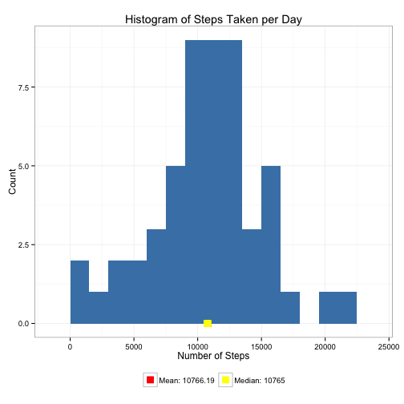
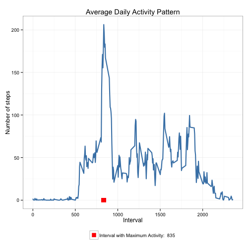
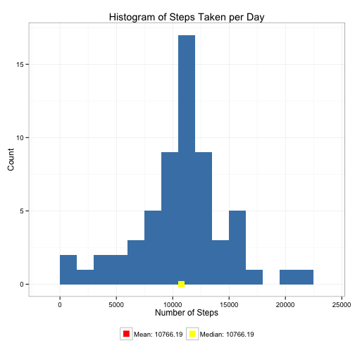
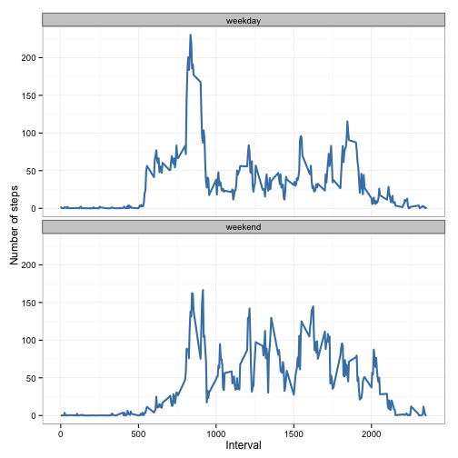

# Reproducible Research: Peer Assessment 1

This assignment makes use of data from a personal activity monitoring device. This device collects data at 5 minute intervals through out the day. The data consists of two months of data from an anonymous individual collected during the months of October and November, 2012 and include the number of steps taken in 5 minute intervals each day.

## Loading and preprocessing the data

1. Load the data (i.e. read.csv())
2. Process/transform the data (if necessary) into a format suitable for your analysis


```r
library(ggplot2)

# download and read the data

file_name = "activity.zip"
source_url = "https://d396qusza40orc.cloudfront.net/repdata%2Fdata%2Factivity.zip"
if (!file.exists(file_name)) {
    download.file(source_url, destfile = file_name, method = "curl")
}

con <- unz(file_name, "activity.csv")
table <- read.csv(con, header = T, colClasses = c("numeric", "character", "numeric"))
table$interval <- factor(table$interval)
table$date <- as.Date(table$date, format = "%Y-%m-%d")
```


```r
summary(table)
```

```
##      steps            date               interval    
##  Min.   :  0.0   Min.   :2012-10-01   0      :   61  
##  1st Qu.:  0.0   1st Qu.:2012-10-16   5      :   61  
##  Median :  0.0   Median :2012-10-31   10     :   61  
##  Mean   : 37.4   Mean   :2012-10-31   15     :   61  
##  3rd Qu.: 12.0   3rd Qu.:2012-11-15   20     :   61  
##  Max.   :806.0   Max.   :2012-11-30   25     :   61  
##  NA's   :2304                         (Other):17202
```

```r
str(table)
```

```
## 'data.frame':	17568 obs. of  3 variables:
##  $ steps   : num  NA NA NA NA NA NA NA NA NA NA ...
##  $ date    : Date, format: "2012-10-01" "2012-10-01" ...
##  $ interval: Factor w/ 288 levels "0","5","10","15",..: 1 2 3 4 5 6 7 8 9 10 ...
```


## What is mean total number of steps taken per day?

1. Make a histogram of the total number of steps taken each day
2. Calculate and report the mean and median total number of steps taken per day


```r
calc_steps_per_day <- function(table) {
    steps_per_day <- aggregate(steps ~ date, table, sum)
    colnames(steps_per_day) <- c("date", "steps")
    steps_per_day
}

plot_steps_per_day <- function(steps_per_day, mean_steps, median_steps) {
    col_labels = c(paste("Mean:", mean_steps), paste("Median:", median_steps))
    cols = c("red", "yellow")
    
    ggplot(steps_per_day, aes(x = steps)) + geom_histogram(fill = "steelblue", 
        binwidth = 1500) + geom_point(aes(x = mean_steps, y = 0, color = "red"), 
        size = 4, shape = 15) + geom_point(aes(x = median_steps, y = 0, color = "yellow"), 
        size = 4, shape = 15) + scale_color_manual(name = element_blank(), labels = col_labels, 
        values = cols) + labs(title = "Histogram of Steps Taken per Day", x = "Number of Steps", 
        y = "Count") + theme_bw() + theme(legend.position = "bottom")
}

steps_per_day <- calc_steps_per_day(table)
mean_steps = round(mean(steps_per_day$steps), 2)
median_steps = round(median(steps_per_day$steps), 2)
plot_steps_per_day(steps_per_day, mean_steps, median_steps)
```

 


- *Mean: 10766.19*
- *Median: 10765*

## What is the average daily activity pattern?

1. Make a time series plot (i.e. type = "l") of the 5-minute interval (x-axis) and the average number of steps taken, averaged across all days (y-axis)
2. Which 5-minute interval, on average across all the days in the dataset, contains the maximum number of steps?


```r
calc_steps_per_interval <- function(table) {
    steps_pi <- aggregate(table$steps, by = list(interval = table$interval), 
        FUN = mean, na.rm = T)
    # convert to integers for plotting
    steps_pi$interval <- as.integer(levels(steps_pi$interval)[steps_pi$interval])
    colnames(steps_pi) <- c("interval", "steps")
    steps_pi
}

plot_activity_pattern <- function(steps_per_interval, max_step_interval) {
    col_labels = c(paste("Interval with Maximum Activity: ", max_step_interval))
    cols = c("red")
    
    ggplot(steps_per_interval, aes(x = interval, y = steps)) + geom_line(color = "steelblue", 
        size = 1) + geom_point(aes(x = max_step_interval, y = 0, color = "red"), 
        size = 4, shape = 15) + scale_color_manual(name = element_blank(), labels = col_labels, 
        values = cols) + labs(title = "Average Daily Activity Pattern", x = "Interval", 
        y = "Number of steps") + theme_bw() + theme(legend.position = "bottom")
}

steps_per_interval <- calc_steps_per_interval(table)
max_step_interval <- steps_per_interval[which.max(steps_per_interval$steps), 
    ]$interval

plot_activity_pattern(steps_per_interval, max_step_interval)
```

 


The *835<sup>th</sup> interval* has the maximum activity on the average.

## Imputing missing values

1. Calculate and report the total number of missing values in the dataset (i.e. the total number of rows with NAs)
2. Devise a strategy for filling in all of the missing values in the dataset. The strategy does not need to be sophisticated. For example, you could use the mean/median for that day, or the mean for that 5-minute interval, etc.
3. Create a new dataset that is equal to the original dataset but with the missing data filled in.
4. Make a histogram of the total number of steps taken each day and Calculate and report the mean and median total number of steps taken per day. Do these values differ from the estimates from the first part of the assignment? What is the impact of imputing missing data on the estimates of the total daily number of steps?


```r
impute_means <- function(table, defaults) {
    na_indices <- which(is.na(table$steps))
    defaults <- steps_per_interval
    na_replacements <- unlist(lapply(na_indices, FUN = function(idx) {
        interval = table[idx, ]$interval
        defaults[defaults$interval == interval, ]$steps
    }))
    imp_steps <- table$steps
    imp_steps[na_indices] <- na_replacements
    imp_steps
}

complete_table <- data.frame(steps = impute_means(table, steps_per_interval), 
    date = table$date, interval = table$interval)
```


```r
summary(complete_table)
```

```
##      steps            date               interval    
##  Min.   :  0.0   Min.   :2012-10-01   0      :   61  
##  1st Qu.:  0.0   1st Qu.:2012-10-16   5      :   61  
##  Median :  0.0   Median :2012-10-31   10     :   61  
##  Mean   : 37.4   Mean   :2012-10-31   15     :   61  
##  3rd Qu.: 27.0   3rd Qu.:2012-11-15   20     :   61  
##  Max.   :806.0   Max.   :2012-11-30   25     :   61  
##                                       (Other):17202
```


```r
complete_steps_per_day <- calc_steps_per_day(complete_table)
complete_mean_steps = round(mean(complete_steps_per_day$steps), 2)
complete_median_steps = round(median(complete_steps_per_day$steps), 2)
plot_steps_per_day(complete_steps_per_day, complete_mean_steps, complete_median_steps)
```

 


## Are there differences in activity patterns between weekdays and weekends?

1. Create a new factor variable in the dataset with two levels – “weekday” and “weekend” indicating whether a given date is a weekday or weekend day.
2. Make a panel plot containing a time series plot (i.e. type = "l") of the 5-minute interval (x-axis) and the average number of steps taken, averaged across all weekday days or weekend days (y-axis). The plot should look something like the following, which was creating using simulated data:


```r
calc_day_of_week_data <- function(complete_table) {
    # I am using RStudio outside the US, so the result of weekdays() is Chinese.
    # Use the Sys.setlocale function
    Sys.setlocale("LC_TIME", "en_US")
    
    complete_table$weekday <- as.factor(weekdays(complete_table$date))
    weekend_data <- subset(complete_table, weekday %in% c("Saturday", "Sunday"))
    weekday_data <- subset(complete_table, !weekday %in% c("Saturday", "Sunday"))
    
    weekend_spi <- calc_steps_per_interval(weekend_data)
    weekday_spi <- calc_steps_per_interval(weekday_data)
    
    weekend_spi$dayofweek <- rep("weekend", nrow(weekend_spi))
    weekday_spi$dayofweek <- rep("weekday", nrow(weekday_spi))
    
    day_of_week_data <- rbind(weekend_spi, weekday_spi)
    day_of_week_data$dayofweek <- as.factor(day_of_week_data$dayofweek)
    day_of_week_data
}

plot_day_of_week_comparison <- function(dow_data) {
    ggplot(dow_data, aes(x = interval, y = steps)) + geom_line(color = "steelblue", 
        size = 1) + facet_wrap(~dayofweek, nrow = 2, ncol = 1) + labs(x = "Interval", 
        y = "Number of steps") + theme_bw()
}

day_of_week_data <- calc_day_of_week_data(complete_table)
plot_day_of_week_comparison(day_of_week_data)
```

 

